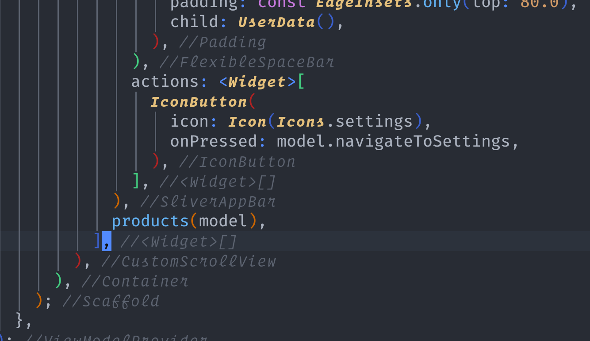

# flutter-tools.nvim

Build flutter and dart applications in neovim using the native lsp.

# Inspiration

This plugin draws inspiration from [`emacs-lsp/lsp-dart`](https://github.com/emacs-lsp/lsp-dart), [`coc-flutter`](https://github.com/iamcco/coc-flutter) and [`nvim-metals`](https://github.com/scalameta/nvim-metals), the idea being
to allow users to easily develop flutter apps using neovim.

## Prerequisites

- `neovim 0.5+` (nightly)

## Installation

using `vim-plug`

```vim
Plug 'nvim-lua/plenary.nvim'
Plug 'akinsho/flutter-tools.nvim'
```

or using `packer.nvim`

```lua
use {'akinsho/flutter-tools.nvim', requires = 'nvim-lua/plenary.nvim'}
```

This plugin depends on [plenary.nvim](https://github.com/nvim-lua/plenary.nvim), please make sure it is installed.

NOTE: flutter tools does not depend on `nvim-lspconfig`. The two can co-exist but please ensure
you do **NOT** configure `dartls` using `lspconfig`. It will be automatically set up by this
plugin instead.

To set it up

```lua
require("flutter-tools").setup{} -- use defaults

-- alternatively you can override the default configs
require("flutter-tools").setup {
  experimental = { -- map of feature flags
    lsp_derive_paths = false, -- experimental: Attempt to find the user's flutter SDK
  },
  debugger = { -- experimental: integrate with nvim dap
    enabled = false,
  },
  flutter_path = "<full/path/if/needed>", -- <-- this takes priority over the lookup
  flutter_lookup_cmd = nil, -- example "dirname $(which flutter)" or "asdf where flutter"
  widget_guides = {
    enabled = false,
  },
  closing_tags = {
    highlight = "ErrorMsg", -- highlight for the closing tag
    prefix = ">" -- character to use for close tag e.g. > Widget
  },
  dev_log = {
    open_cmd = "tabedit", -- command to use to open the log buffer
  },
  outline = {
    open_cmd = "30vnew", -- command to use to open the outline buffer
  },
  lsp = {
    on_attach = my_custom_on_attach,
    capabilities = my_custom_capabilities -- e.g. lsp_status capabilities
    settings = {
      showTodos = true,
      completeFunctionCalls = true -- NOTE: this is WIP and doesn't work currently
    }
  }
}
```

You can override any options available in the `lspconfig` setup, this call essentially wraps
it and adds some extra `flutter` specific handlers and utilisation options.

#### Flutter binary

In order to run flutter commands you _might_ need to pass either a _path_ or a _command_ to the plugin so it can find your
installation of flutter. Most people will not need this since it will find the executable path of `flutter` if it is in your `$PATH`.

If using something like `asdf` or some other version manager, or you installed flutter via `snap` or in some other custom way,
then you need to pass in a command by specifying `flutter_lookup_cmd = <my-command>`.
If you have a full path already you can pass it in using `flutter_path`.

If using a `snap` installation set your `flutter_lookup_cmd` to `"echo $HOME/snap/flutter/common/flutter/bin/flutter"`
which is where this is usually installed by `snap`. Alternatively you can use the `experimental.lsp_derive_paths` option
which should auto-magically find your flutter installation.

### Telescope Integration


You can list available commands in this plugin using [telescope.nvim](https://github.com/nvim-telescope/telescope.nvim).

In order to set this up, you can explicitly load the extension.

```lua
require("telescope").load_extension("flutter")
```

Or alternatively telescope can lazy load extension but the `Telescope` command will not autocomplete lazy loaded modules.

This can be accessed using `Telescope flutter commands` or `require('telescope').extensions.flutter.commands()`

# Functionality

#### Run flutter app with hot reloading


#### Start emulators or connected devices


#### Visualise logs


#### Widget guides (experimental, default: disabled)


NOTE: To configure the highlight colour you can override the `FlutterWidgetGuides` highlight group

#### Outline window


#### Closing Tags



# Usage

- `FlutterRun` - Run the current project. This needs to be run from within a flutter project.
- `FlutterDevices` - Brings up a list of connected devices to select from.
- `FlutterEmulators` - Similar to devices but shows a list of emulators to choose from.
- `FlutterReload` - Reload the running project
- `FlutterRestart` - Restart the current project
- `FlutterQuit` - Ends a running session
- `FlutterOutline` - Opens an outline window showing the widget tree for the given file

## Debugging

_Requires nvim-dap_

```lua
-- with packer
use 'mfussenegger/nvim-dap'
```

This plugin integrates with [nvim-dap](https://github.com/mfussenegger/nvim-dap) to provide debug capabilities.
Currently if `debugger` is set to `true` in the user's config **it will expect `nvim-dap` to be installed**.
If `dap` is installed the plugin will attempt to install the debugger (Dart-Code's debugger).

To use the debugger you need to run `:lua require('dap').continue()<CR>`. This will start your app. You should then be able
to use `dap` commands to begin to debug it. For more information on how to use `nvim-dap` please read the project's README
or see `:h dap`.

Also see:
- [nvim-dap-ui](https://github.com/rcarriga/nvim-dap-ui) - a plugin which provides a nice UI for `nvim-dap`.
